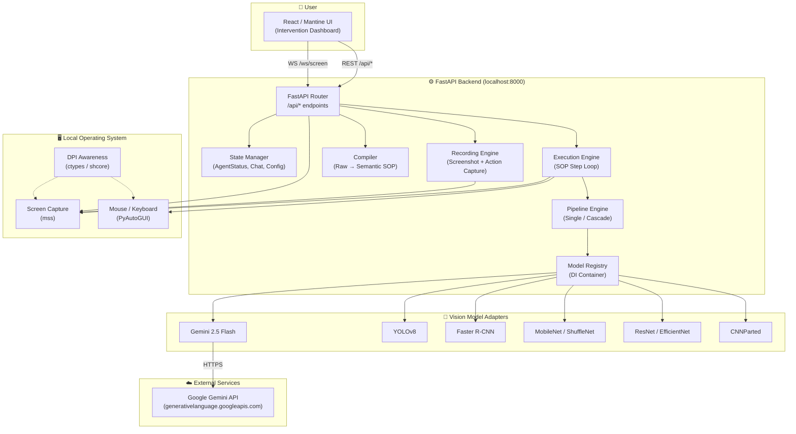
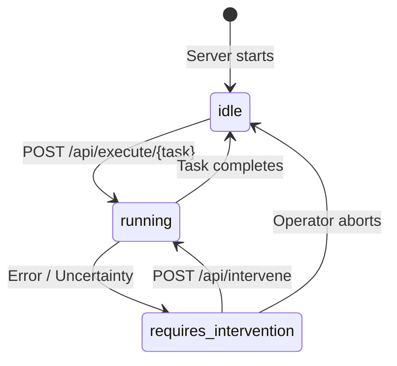
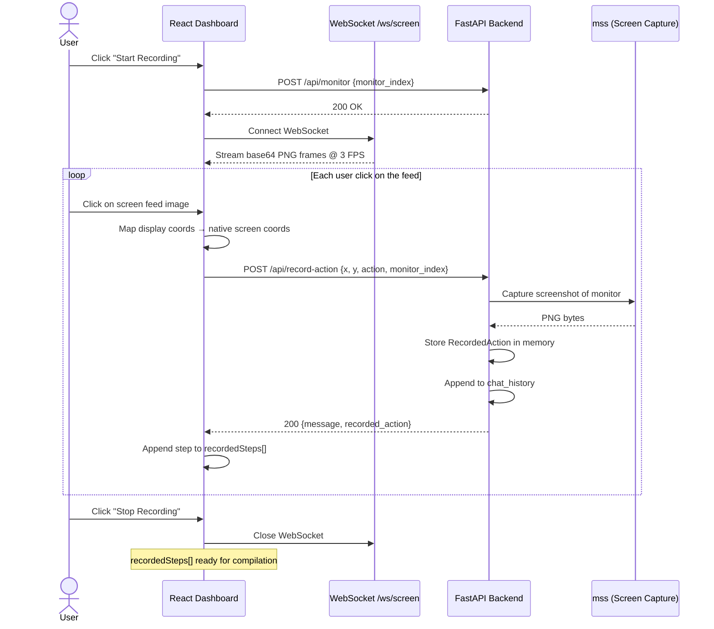
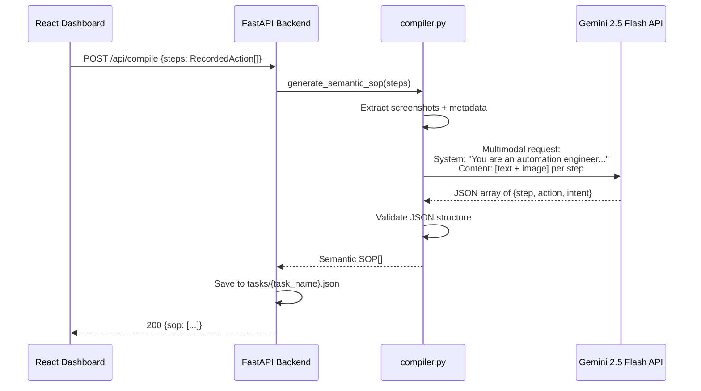
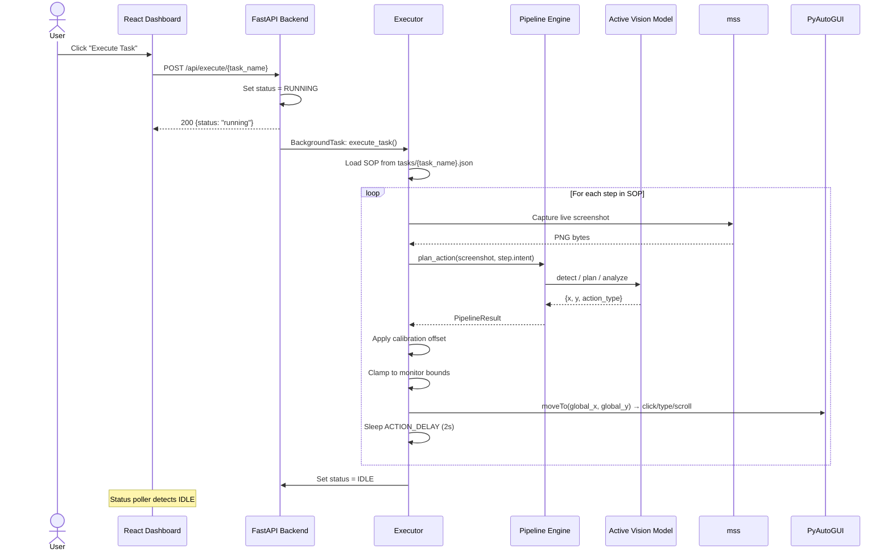
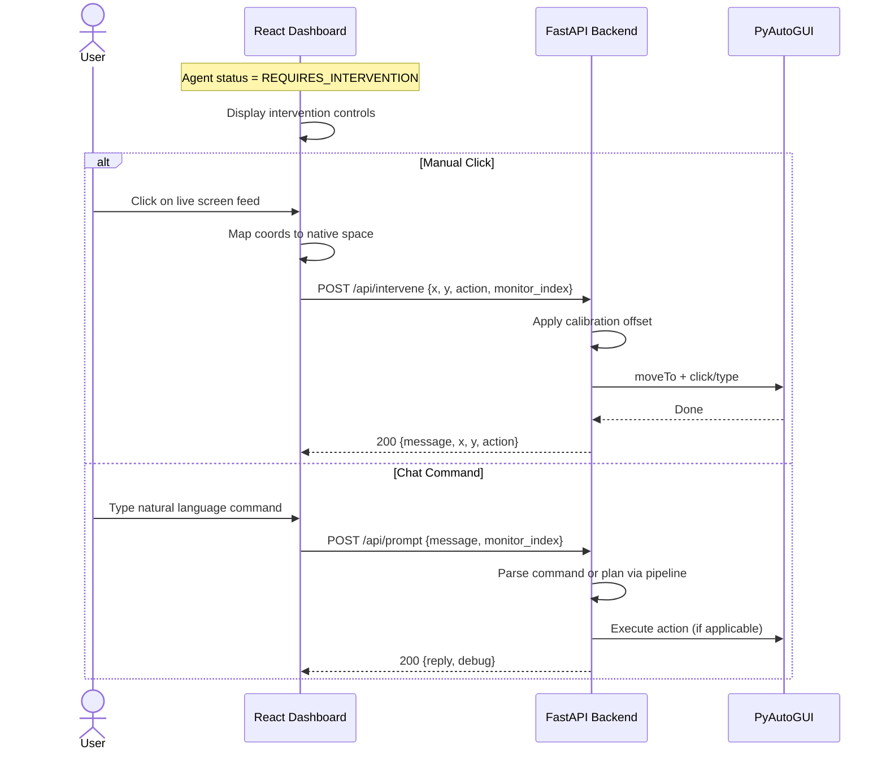

# Architecture Design Document — Windows Agent

**Version:** 1.0  
**Date:** April 17, 2026  
**Author:** AI Systems Architecture  
**Status:** Living Document

---

## Table of Contents

1. [Executive Summary & System Goals](#1-executive-summary--system-goals)
2. [System Architecture Overview](#2-system-architecture-overview)
3. [Component Deep-Dives](#3-component-deep-dives)
4. [Data Flow Diagrams](#4-data-flow-diagrams)
5. [Model Dependency Injection & Pipeline](#5-model-dependency-injection--pipeline)
6. [API Contracts](#6-api-contracts)
7. [Data Contracts (Pydantic Models)](#7-data-contracts-pydantic-models)
8. [WebSocket Protocol](#8-websocket-protocol)
9. [Security & Deployment Strategy](#9-security--deployment-strategy)
10. [Appendix](#10-appendix)

---

## 1. Executive Summary & System Goals

### 1.1 Problem Statement

Enterprise knowledge workers spend significant time on repetitive, multi-step UI tasks (CRM data entry, form filling, report generation) that involve navigating between applications, clicking through menus, and transcribing data. Traditional automation approaches (RPA macro recorders, hardcoded coordinate scripts) are **brittle** — a single UI layout change, resolution difference, or window reposition breaks the entire workflow.

### 1.2 Solution

Windows Agent is a **local, vision-based AI OS-control agent** that replaces brittle coordinate-locked macros with **semantic understanding of the screen**. Instead of remembering "click at pixel (347, 891)," the system remembers "click the Submit button" and uses a Vision-Language Model (VLM) to locate that element dynamically on every execution — regardless of window position, resolution, or minor UI changes.

### 1.3 Core Design Principles

| Principle | Description |
|-----------|-------------|
| **Semantic over Positional** | All actions are described by intent ("Click the Save button"), never by raw coordinates. Coordinates are derived at runtime via vision. |
| **Record → Compile → Execute** | A three-phase lifecycle separates human demonstration, intent abstraction, and autonomous replay. |
| **Human-in-the-Loop** | The Intervention Dashboard provides real-time screen streaming, manual override, and chat-based correction during execution. |
| **Model Agnosticism** | A dependency injection layer allows any vision model (Gemini, YOLO, Faster R-CNN, etc.) to be swapped or composed into multi-stage pipelines without code changes. |
| **Local-First** | All OS-level control (mouse, keyboard, screenshots) runs on the local machine. Only the VLM inference call leaves the network boundary. |

### 1.4 System Goals

- **G1:** Enable non-technical users to record a UI task once and replay it reliably across sessions.
- **G2:** Achieve > 90% action accuracy on stable UI layouts using Gemini 2.5 Flash as the default VLM.
- **G3:** Provide real-time visual feedback and intervention controls so a human operator can correct the agent mid-task.
- **G4:** Support pipeline composition (detector → classifier → planner) for future accuracy improvements with specialized CNN models.
- **G5:** Maintain a sub-3-second per-step latency budget (screenshot capture + VLM inference + action execution).

---

## 2. System Architecture Overview

### 2.1 High-Level Architecture Diagram



### 2.2 Technology Stack

| Layer | Technology | Role |
|-------|-----------|------|
| **Frontend** | React 18, Mantine UI, Vite 8 | Dashboard, controls, live screen feed |
| **Backend** | Python 3.11+, FastAPI, Uvicorn | REST API, WebSocket, orchestration |
| **OS Control** | PyAutoGUI 0.9.54 | Mouse movement, clicks, keyboard input |
| **Screen Capture** | mss 9.0.2 | Multi-monitor screenshot capture |
| **AI / Vision** | Google Gemini (via `google-generativeai` 0.8.5) | Primary VLM for planning and detection |
| **CNN Models** | PyTorch, torchvision, ultralytics, timm | Optional specialized detection/classification |
| **Communication** | REST (JSON), WebSocket (base64 PNG) | State management, live screen streaming |

---

## 3. Component Deep-Dives

### 3.1 Frontend — Intervention Dashboard

**Responsibility:** Provide the human operator with real-time visibility into the agent's actions, manual override controls, and task configuration.

#### Component Hierarchy

```
App.jsx
├── Status Poller (GET /api/status @ 3s interval)
└── InterventionDashboard.jsx
    ├── Monitor Selector          → GET /api/monitors, POST /api/monitor
    ├── Vision Model Selector     → GET /api/models, POST /api/models/set
    ├── Pipeline Controls         → GET /api/pipeline, POST /api/pipeline
    ├── Action Mode Toggle        → Click / Move
    ├── Live Screen Feed          → WebSocket /ws/screen
    ├── Click Handler             → POST /api/intervene
    ├── ChatPanel.jsx
    │   ├── Message Display       → GET /api/chat
    │   ├── Prompt Input          → POST /api/prompt
    │   └── Clear History         → DELETE /api/chat
    └── RecordTaskPanel.jsx
        ├── Recording Controls    → Start/Stop toggle
        ├── Recording Screen Feed → WebSocket /ws/screen (2nd connection)
        └── Step Capture          → POST /api/record-action
```

#### Key State Variables

| Component | State | Type | Purpose |
|-----------|-------|------|---------|
| `App` | `agentStatus` | `"idle" \| "running" \| "requires_intervention" \| "disconnected"` | Backend health and execution state |
| `InterventionDashboard` | `monitors` | `MonitorInfo[]` | Physical display list from mss |
| | `selectedMonitor` | `int` | Active monitor for screen feed |
| | `availableModels` | `{name, active}[]` | Registered vision models |
| | `pipelineMode` | `"single" \| "cascade"` | Pipeline execution mode |
| | `detectorModel`, `classifierModel`, `plannerModel` | `string` | Cascade stage assignments |
| `ChatPanel` | `messages` | `ChatMessage[]` | Conversation history with screenshots |
| `RecordTaskPanel` | `isRecording` | `boolean` | Recording session active flag |
| | `recordedSteps` | `RecordedAction[]` | Captured actions with screenshots |

#### Live Screen Feed Protocol

The dashboard maintains a WebSocket connection to `/ws/screen`. Each frame is a raw base64-encoded PNG string (no JSON envelope). The frontend renders frames by setting `img.src = \`data:image/png;base64,${frame}\``. Reconnection uses exponential backoff (2s → 30s cap).

---

### 3.2 FastAPI Router

**Responsibility:** Accept HTTP/WS requests, validate input, delegate to subsystems, manage global state.

#### Route Groups

| Group | Prefix | Purpose |
|-------|--------|---------|
| **Status** | `/api/status` | Agent lifecycle state |
| **Intervention** | `/api/intervene` | Manual mouse/keyboard actions |
| **Monitors** | `/api/monitors`, `/api/monitor` | Display configuration |
| **Calibration** | `/api/calibration` | Per-monitor pixel offset correction |
| **Chat** | `/api/chat`, `/api/prompt` | Conversational AI interaction |
| **Screenshot** | `/api/screenshot` | On-demand screen capture |
| **Models** | `/api/models` | Vision model DI management |
| **Pipeline** | `/api/pipeline` | Multi-model pipeline configuration |
| **Recording** | `/api/record-action`, `/api/recorded-actions` | Task demonstration capture |
| **Execution** | `/api/execute/{task_name}` | Autonomous SOP replay |
| **Analysis** | `/api/analyze-screen` | One-shot vision analysis |
| **Screen Feed** | `/ws/screen` | Live screenshot stream |

#### Global State (In-Memory)

```
agent_status: AgentStatus           — Current lifecycle state
chat_history: list[dict]            — Conversation messages
recorded_actions: list[dict]        — Recorded demonstration steps
selected_monitor_index: int         — Active monitor (1-indexed mss)
calibration_offsets: dict[int, dict] — Per-monitor {offset_x, offset_y}
pipeline_config: PipelineConfig     — Active pipeline configuration
is_execution_running: bool          — Execution mutex guard
```

> **Note:** All state is in-memory. A server restart clears all session data. Compiled SOPs persist as JSON files under `tasks/`.

---

### 3.3 Vision / Execution Engine

**Responsibility:** Orchestrate the three-phase lifecycle (Record → Compile → Execute) and manage OS-level interactions.

#### 3.3.1 Recording Engine

The recording system captures human demonstrations as a sequence of `(x, y, action, screenshot)` tuples:

1. The operator enables recording mode in the `RecordTaskPanel` UI.
2. The frontend opens a dedicated WebSocket to `/ws/screen` for a live feed with visual recording indicator.
3. Each operator click on the feed image is coordinate-mapped from display space to native screen space using `naturalWidth/naturalHeight` scaling.
4. The frontend sends `POST /api/record-action` with the computed coordinates and monitor index.
5. The backend captures a screenshot at the moment of action via `mss` and stores the `RecordedAction` in memory.

**Output:** An ordered array of `RecordedAction` objects, each containing the action's coordinates, type, monitor, and a base64 PNG screenshot of the screen at that instant.

#### 3.3.2 Compiler (`backend/compiler.py`)

The compiler transforms raw recorded actions into a semantic Standard Operating Procedure (SOP):

**Input:** `list[RecordedAction]` — raw click/type events with screenshots.

**Process:**
1. Constructs a multimodal Gemini prompt containing, for each step:
   - A text segment with action metadata (coordinates, action type).
   - An inline image part (the screenshot at that moment).
2. Gemini acts as an "expert automation engineer," inspecting each screenshot and metadata pair to deduce the user's intent.

**System Prompt (abridged):**
> *You are an expert automation engineer. You will receive an ordered set of UI interaction steps. Each step contains a screenshot and raw action metadata. Your job: inspect each screenshot and metadata, infer the user intent, and return strict JSON.*

**Output (the SOP):**
```json
[
  {"step": 1, "action": "click", "intent": "Click the 'Save' button in Aspire"},
  {"step": 2, "action": "click", "intent": "Select the 'File' menu"},
  {"step": 3, "action": "type",  "intent": "Type the customer name into the search field"}
]
```

**Validation:** Output must be a JSON array; each element must contain `step` (int), `action` (str), `intent` (str). Markdown code fences are stripped before parsing.

#### 3.3.3 Execution Engine (`backend/executor.py`)

The executor replays a compiled SOP step-by-step using live vision:

```
┌─────────────────────────────────────────────┐
│              EXECUTION LOOP                 │
│                                             │
│  for each step in SOP:                      │
│    1. Capture live screenshot (mss)         │
│    2. Send screenshot + step.intent         │
│       to Pipeline Engine                    │
│    3. Receive {x, y, action_type}           │
│    4. Apply calibration offset              │
│    5. Clamp to monitor bounds               │
│    6. Execute via PyAutoGUI                 │
│    7. Sleep ACTION_DELAY (2s default)       │
│                                             │
│  On error → set status to                   │
│    REQUIRES_INTERVENTION                    │
│  On completion → set status to IDLE         │
└─────────────────────────────────────────────┘
```

**Action Execution Details:**

| Action Type | PyAutoGUI Sequence |
|-------------|-------------------|
| `click` | `moveTo(x, y, duration=0.5)` → `click()` |
| `type` | `moveTo(x, y)` → `click()` → `write(text, interval=0.05)` |
| `scroll` | `moveTo(x, y)` → `scroll(-500)` |

**Coordinate System:**
- The VLM returns coordinates relative to the captured screenshot (monitor-local).
- The executor converts to global screen coordinates: `global_x = monitor.left + x`.
- Calibration offsets are applied additively: `adjusted_x = x + offset_x`.
- Final coordinates are clamped to `[0, monitor.width - 1]` × `[0, monitor.height - 1]`.

**Concurrency Guard:** A global `is_execution_running` flag prevents concurrent task executions. `POST /api/execute/{task_name}` returns HTTP 409 if a task is already running.

---

### 3.4 State Manager

**Responsibility:** Maintain agent lifecycle state, configuration, and session data.

#### Agent Lifecycle States



| State | Description |
|-------|-------------|
| `idle` | No task running. Ready for commands. |
| `running` | Actively executing an SOP. Screen feed shows live progress. |
| `requires_intervention` | Execution paused. Awaiting human guidance via the dashboard. |

#### Calibration System

Per-monitor pixel offsets correct for DPI scaling mismatches between `mss` screenshot coordinates and `pyautogui` cursor coordinates:

- **Set directly:** `POST /api/calibration` with `{monitor_index, offset_x, offset_y}`.
- **Compute from error:** `POST /api/calibration/compute` accepts `{target_x, target_y, actual_x, actual_y}` and accumulates the delta into the stored offset.
- **Clear:** `DELETE /api/calibration/{monitor_index}` resets to zero.

---

## 4. Data Flow Diagrams

### 4.1 Recording Phase



### 4.2 Compilation Phase



### 4.3 Execution Phase



### 4.4 Intervention Flow



---

## 5. Model Dependency Injection & Pipeline

### 5.1 Abstract Interface

All vision models implement the `VisionModel` abstract base class:

```
┌─────────────────────────────────────────┐
│           VisionModel (ABC)             │
├─────────────────────────────────────────┤
│ + name: str                             │
├─────────────────────────────────────────┤
│ + detect_element(screenshot, intent,    │
│     monitor_bounds) → {x, y, ...}       │
│                                         │
│ + plan_action(screenshot, prompt,       │
│     monitor_bounds) → {action, x, y,    │
│     reason}                             │
│                                         │
│ + analyze(screenshot, prompt)           │
│     → dict[str, Any]                    │
└─────────────────────────────────────────┘
```

| Method | Purpose | Expected Return |
|--------|---------|----------------|
| `detect_element()` | Locate a UI element by intent description | `{x, y, action_type, text_to_type}` |
| `plan_action()` | High-level planning: decide what action to take | `{action, x, y, reason}` |
| `analyze()` | Free-form screen analysis (classification, context) | Arbitrary JSON dict |

### 5.2 Model Registry

The registry implements a simple dependency injection container with lazy instantiation:

```
┌────────────────────────────────────────────────────────┐
│                    Model Registry                      │
├────────────────────────────────────────────────────────┤
│ _registry: dict[str, Type[VisionModel]]   (classes)    │
│ _instances: dict[str, VisionModel]        (singletons) │
│ _active_model_name: str | None                         │
├────────────────────────────────────────────────────────┤
│ register(name, cls)          → void                    │
│ get_model(name)              → VisionModel             │
│ set_active_model(name)       → void                    │
│ get_active_model()           → VisionModel | None      │
│ list_models()                → [{name, active}]        │
└────────────────────────────────────────────────────────┘
```

- **Registration** happens at module import via `model_registry("name", ClassName)`.
- **Instantiation** is lazy — models are constructed on first `get_model()` call.
- **Failures are isolated** — if a model's dependencies (e.g., `torch`) are missing, its adapter silently fails to register. Other models remain available.

### 5.3 Registered Models

| Name | Type | Dependencies | Capabilities |
|------|------|-------------|--------------|
| `gemini` | Multimodal VLM | `google-generativeai` | Detection + Planning + Analysis. Default model. Uses API fallback chain: `gemini-2.5-flash` → `gemini-2.5-flash-lite` → `gemini-2.0-flash`. |
| `yolo` | Object Detector | `ultralytics`, `PIL` | Real-time bounding box detection. YOLOv8 Nano default. Configurable via `YOLO_MODEL`, `YOLO_CONFIDENCE`. |
| `faster-rcnn` | Object Detector | `torch`, `torchvision` | High-accuracy detection. ResNet-50 FPN v2 backbone. Configurable via `FASTER_RCNN_CHECKPOINT`, `FASTER_RCNN_SCORE_THRESH`. |
| `mobilenet-shufflenet` | Classifier | `torch`, `torchvision` | Lightweight classification. Returns screen center (no localization). Arch via `MOBILENET_ARCH`. |
| `resnet-efficientnet` | Classifier | `torch`, `torchvision`, `timm` | Image classification. Returns screen center (no localization). Arch via `TIMM_MODEL_NAME`. |
| `cnnparted` | Partitioned Classifier | `torch`, CNNParted repo | Split-inference research model. Configurable split layer for edge/cloud partitioning. |

> **Important:** Classification models (`mobilenet-shufflenet`, `resnet-efficientnet`, `cnnparted`) **cannot localize UI elements** — they return the screen center. They must be paired with a detection model in cascade mode for coordinate accuracy.

### 5.4 Pipeline Engine

The pipeline supports two execution modes:

#### Single Mode
```
Screenshot + Intent → [Active Model].plan_action() → {x, y, action}
```

#### Cascade Mode
```
Screenshot + Intent
    │
    ├─→ [Detector].detect_element()     → {x, y, ...}
    │       (default: yolo)
    │
    ├─→ [Classifier].analyze()          → {context}
    │       (default: mobilenet-shufflenet)
    │
    └─→ [Planner].plan_action()         → {x, y, action, reason}
            (default: gemini)
            Input: user intent + detector coords + classifier context
```

**Cascade Composition Prompt (to the Planner):**
> *User request: {intent}. Detector suggestion: {detection_json}. Classifier context: {classification_json}. Use the detector coordinates unless classifier context strongly contradicts them.*

**Fallback Logic:** If the planner's response lacks `x`/`y` coordinates, the pipeline falls back to the detector's coordinates.

**Performance Instrumentation:** Each pipeline stage is independently timed via `time.perf_counter()`. Debug output includes per-stage and total latency in milliseconds.

---

## 6. API Contracts

### 6.1 Status & Lifecycle

#### `GET /api/status`
Returns the current agent lifecycle state.

**Response `200`:**
```json
{
  "status": "idle"          // "idle" | "running" | "requires_intervention"
}
```

---

### 6.2 Intervention

#### `POST /api/intervene`
Execute a manual OS action at specified coordinates.

**Request:**
```json
{
  "x": 450,
  "y": 320,
  "action": "click",           // Optional, default: "click"
  "monitor_index": 1           // Optional, uses selected monitor
}
```

**Response `200`:**
```json
{
  "message": "Intervention executed: click at (450, 320)",
  "x": 450,
  "y": 320,
  "action": "click"
}
```

---

### 6.3 Monitor Management

#### `GET /api/monitors`
**Response `200`:**
```json
{
  "selected_monitor_index": 1,
  "monitors": [
    {
      "mss_index": 1,
      "display_index": 0,
      "label": "Display 1 (1920×1080)",
      "left": 0,
      "top": 0,
      "width": 1920,
      "height": 1080
    }
  ]
}
```

#### `POST /api/monitor`
**Request:**
```json
{ "monitor_index": 2 }
```

---

### 6.4 Calibration

#### `POST /api/calibration`
Set absolute offset for a monitor.

**Request:**
```json
{ "monitor_index": 1, "offset_x": -5, "offset_y": 3 }
```

#### `POST /api/calibration/compute`
Compute offset from an observed click error.

**Request:**
```json
{
  "monitor_index": 1,
  "target_x": 500,
  "target_y": 300,
  "actual_x": 495,
  "actual_y": 303
}
```

**Response `200`:**
```json
{ "monitor_index": 1, "offset_x": 5, "offset_y": -3 }
```

---

### 6.5 Chat & Prompt

#### `POST /api/prompt`
Send a natural language command or question.

**Request:**
```json
{
  "message": "Click on the Submit button",
  "monitor_index": 1             // Optional
}
```

**Response `200`:**
```json
{
  "reply": "I clicked on the Submit button at coordinates (834, 456).",
  "debug": {
    "mode": "cascade",
    "latency_ms": {
      "detector": 120.5,
      "classifier": 85.3,
      "planner": 340.1,
      "total": 545.9
    }
  }
}
```

#### `GET /api/chat`
**Response `200`:**
```json
{
  "messages": [
    {"role": "user", "content": "Click the Submit button", "screenshot": null},
    {"role": "assistant", "content": "Done.", "screenshot": "base64..."}
  ]
}
```

#### `DELETE /api/chat`
Clears `chat_history` and `recorded_actions`.

---

### 6.6 Recording

#### `POST /api/record-action`
Capture a single demonstrated action.

**Request:**
```json
{
  "x": 834,
  "y": 456,
  "action": "click",
  "monitor_index": 1
}
```

**Response `200`:**
```json
{
  "message": "Recorded action at (834, 456)",
  "recorded_action": {
    "x": 834,
    "y": 456,
    "action": "click",
    "monitor_index": 1,
    "screenshot": "iVBORw0KGgo..."
  }
}
```

#### `GET /api/recorded-actions`
**Response `200`:**
```json
{
  "actions": [
    {"x": 834, "y": 456, "action": "click", "monitor_index": 1, "screenshot": "..."}
  ]
}
```

---

### 6.7 Execution

#### `POST /api/execute/{task_name}`
Start autonomous replay of a compiled SOP.

**Path Parameters:**
- `task_name` (string) — Name of the task file (without `.json` extension) under `tasks/`.

**Response `200`:**
```json
{
  "message": "Task 'crm_data_entry' execution started",
  "task_name": "crm_data_entry",
  "status": "running"
}
```

**Response `409` (conflict):**
```json
{
  "detail": "Another task is already running"
}
```

---

### 6.8 Vision Models

#### `GET /api/models`
**Response `200`:**
```json
{
  "models": [
    {"name": "gemini", "active": true},
    {"name": "yolo", "active": false},
    {"name": "faster-rcnn", "active": false}
  ]
}
```

#### `POST /api/models/set`
**Request:**
```json
{ "name": "yolo" }
```

**Response `400`:**
```json
{ "detail": "Unknown model: invalid_name" }
```

---

### 6.9 Pipeline

#### `GET /api/pipeline`
**Response `200`:**
```json
{
  "pipeline": {
    "mode": "cascade",
    "detector_model": "yolo",
    "classifier_model": "mobilenet-shufflenet",
    "planner_model": "gemini"
  }
}
```

#### `POST /api/pipeline`
**Request:**
```json
{
  "mode": "cascade",
  "detector_model": "yolo",
  "classifier_model": "resnet-efficientnet",
  "planner_model": "gemini"
}
```

---

### 6.10 Analysis

#### `POST /api/analyze-screen`
One-shot vision analysis of a provided image.

**Request:**
```json
{
  "image": "iVBORw0KGgo...",    // base64 PNG
  "prompt": "What buttons are visible on screen?"
}
```

**Response `200`:**
```json
{
  "plan": {"action": "click", "x": 500, "y": 300, "reason": "Submit button found"},
  "debug": {"mode": "single", "planner": "gemini", "latency_ms": {"planner": 420.1}}
}
```

---

### 6.11 Screenshot

#### `GET /api/screenshot`
**Response `200`:**
```json
{
  "screenshot": "iVBORw0KGgo...",
  "monitor_index": 1
}
```

---

## 7. Data Contracts (Pydantic Models)

### 7.1 Enums

```
AgentStatus: "idle" | "running" | "requires_intervention"
```

### 7.2 Core Models

| Model | Fields | Usage |
|-------|--------|-------|
| `StatusResponse` | `status: AgentStatus` | `GET /api/status` response |
| `InterveneRequest` | `x: int, y: int, action: str = "click", monitor_index: int \| None` | Manual action input |
| `InterveneResponse` | `message: str, x: int, y: int, action: str` | Action confirmation |
| `MonitorInfo` | `mss_index: int, display_index: int, label: str, left/top/width/height: int` | Monitor descriptor |
| `MonitorListResponse` | `selected_monitor_index: int, monitors: list[MonitorInfo]` | All monitors |
| `ChatMessage` | `role: str, content: str, screenshot: str \| None` | Chat entry |
| `PromptRequest` | `message: str, monitor_index: int \| None` | User prompt |
| `PromptResponse` | `reply: str, debug: dict \| None` | AI response with optional timing |
| `RecordedAction` | `x: int, y: int, action: str, monitor_index: int, screenshot: str` | Single recorded step |
| `RecordActionRequest` | `x: int, y: int, action: str = "click", monitor_index: int` | Record capture input |
| `ScreenshotResponse` | `screenshot: str, monitor_index: int` | Base64 PNG snapshot |
| `AnalyzeScreenRequest` | `image: str, prompt: str` | One-shot analysis input |
| `CalibrationOffset` | `monitor_index: int, offset_x: int, offset_y: int` | Per-monitor correction |
| `CalibrationComputeRequest` | `monitor_index/target_x/target_y/actual_x/actual_y: int` | Error-based calibration |
| `SetModelRequest` | `name: str` | Model switch input |
| `PipelineConfigRequest` | `mode: str, detector_model/classifier_model/planner_model: str \| None` | Pipeline update |
| `ExecuteTaskResponse` | `message: str, task_name: str, status: AgentStatus` | Task launch confirmation |

### 7.3 Internal Data Structures

| Structure | Module | Fields |
|-----------|--------|--------|
| `PipelineConfig` (dataclass) | `pipeline.py` | `mode: str, detector_model: str, classifier_model: str, planner_model: str` |
| `PipelineResult` (dataclass) | `pipeline.py` | `plan: dict, debug: dict` |
| **SOP Step** (JSON) | `tasks/*.json` | `step: int, action: str, intent: str` |

---

## 8. WebSocket Protocol

### Endpoint: `/ws/screen`

| Property | Value |
|----------|-------|
| **URL** | `ws://localhost:8000/ws/screen` |
| **Direction** | Server → Client (unidirectional) |
| **Frame Type** | Text |
| **Frame Content** | Raw base64-encoded PNG string (no JSON envelope, no data URI prefix) |
| **Frame Rate** | ~3 FPS (`asyncio.sleep(1/3)`) |
| **Screenshot Source** | Currently selected monitor via `mss` |
| **Lifecycle** | Persistent until client disconnect |
| **Reconnection** | Client-side exponential backoff (2s initial, 30s max) |

**Client rendering pattern:**
```
onmessage(event) → img.src = `data:image/png;base64,${event.data}`
```

**Concurrency:** Multiple WebSocket connections are supported (the recording panel opens a second connection). All connections stream from the same selected monitor.

---

## 9. Security & Deployment Strategy

### 9.1 Threat Model

| Threat | Vector | Mitigation |
|--------|--------|-----------|
| **Remote exploitation** | Attacker accesses API from non-local origin | Localhost-only binding + network firewall |
| **Runaway automation** | Agent clicks destructively in a loop | PyAutoGUI failsafe (corner escape) + execution mutex |
| **Path traversal** | Malicious `task_name` in `/api/execute/{task_name}` | Path validation: reject `..`, verify resolved path is under `tasks/` |
| **Input collision** | User and agent fight for mouse/keyboard | Sterile VM deployment (no human cursor on agent's desktop) |
| **API key exposure** | Gemini API key leaked in logs or responses | Key loaded from `.env` files, never echoed in API responses |
| **Coordinate overflow** | VLM returns out-of-bounds coordinates | Clamping to `[0, monitor_dimension - 1]` before execution |

### 9.2 PyAutoGUI Failsafe

```python
pyautogui.FAILSAFE = True   # Enabled by default in executor.py
```

**Behavior:** Moving the physical mouse to any screen corner raises `pyautogui.FailSafeException`, immediately aborting the current PyAutoGUI action. This is the **emergency stop** mechanism.

**Recommendation:** Operators should be trained to move their mouse to the top-left corner if the agent behaves unexpectedly.

### 9.3 Localhost Binding

**Requirement:** The FastAPI server MUST be bound to `127.0.0.1` (loopback) in production:

```bash
uvicorn backend.main:app --host 127.0.0.1 --port 8000
```

**Rationale:** The agent has unrestricted OS-level control (mouse, keyboard, screen capture). Exposing the API to `0.0.0.0` would allow any device on the local network to issue `POST /api/intervene` and control the machine remotely.

### 9.4 CORS Policy

**Current state (development):**
```python
allow_origins=["*"]   # Accepts all origins
```

**Recommended production policy:**
```python
allow_origins=["http://localhost:5173", "http://127.0.0.1:5173"]
```

Lock CORS to the specific frontend origin to prevent cross-origin API abuse if the machine is network-accessible.

### 9.5 DPI Awareness

Windows DPI awareness is set to Per-Monitor V2 at process startup:

```python
ctypes.windll.shcore.SetProcessDpiAwareness(2)
```

**Why it matters:** Without DPI awareness, `mss` captures screenshots at the logical (scaled) resolution, but `pyautogui` operates at the physical resolution. This creates a coordinate mismatch where the agent clicks at the wrong position. Per-Monitor V2 awareness ensures both subsystems operate in the same coordinate space.

### 9.6 Deployment Strategy: Sterile Virtual Machine

**Problem:** When the agent takes control of the mouse and keyboard, human input on the same machine creates **input collisions** — the operator's cursor movement interrupts the agent's `moveTo()` calls, causing misclicks.

**Recommended deployment topology:**

```
┌─────────────────────────────────┐    ┌──────────────────────────────────┐
│   OPERATOR WORKSTATION          │    │   STERILE VM (Agent Desktop)     │
│                                 │    │                                  │
│   Browser (React Dashboard)     │    │   FastAPI Backend                │
│     ↕ REST/WS                   │    │   PyAutoGUI (full OS control)    │
│                                 │    │   mss (screenshot)              │
│   No Python, no agent code.     │    │   Target applications           │
│   Display-only + controls.      │    │   (CRM, browser, etc.)          │
│                                 │    │                                  │
│   http://vm-ip:8000/ws/screen   │──→ │   uvicorn --host 0.0.0.0 *     │
└─────────────────────────────────┘    └──────────────────────────────────┘
                                        * Only if on isolated network segment
```

**VM Requirements:**
- Windows 10/11 with the same display resolution as the target workflow.
- No other mouse/keyboard input sources (no RDP cursor visible during execution).
- Target applications pre-installed and pre-authenticated.
- Network access to Google Gemini API (`generativelanguage.googleapis.com`).

**Alternative (development):** Run both frontend and backend on the same machine. Accept that the operator must not touch the mouse/keyboard during execution. The PyAutoGUI failsafe (mouse to corner) serves as the emergency stop.

### 9.7 Environment Variable Configuration

| Variable | Default | Description |
|----------|---------|-------------|
| `GEMINI_API_KEY` | *(required)* | Google AI Studio API key |
| `YOLO_MODEL` | `yolov8n.pt` | YOLO model weights file |
| `YOLO_CONFIDENCE` | `0.25` | YOLO detection confidence threshold |
| `FASTER_RCNN_CHECKPOINT` | *(none, uses pretrained)* | Custom Faster R-CNN weights |
| `FASTER_RCNN_SCORE_THRESH` | `0.5` | Detection score threshold |
| `FASTER_RCNN_LABELS` | *(none)* | Comma-separated class labels |
| `MOBILENET_ARCH` | `mobilenet_v3_small` | torchvision classifier architecture |
| `MOBILENET_CHECKPOINT` | *(none, uses pretrained)* | Custom classifier weights |
| `TIMM_MODEL_NAME` | `efficientnet_b0` | timm model architecture name |
| `TIMM_CHECKPOINT` | *(none, uses pretrained)* | Custom timm weights |
| `CNNPARTED_REPO` | *(none)* | Path to CNNParted repository clone |
| `CNNPARTED_BASE_MODEL` | `resnet18` | Base model for partitioning |
| `CNNPARTED_SPLIT_LAYER` | `4` | Layer index to split at |
| `ACTION_DELAY_SECONDS` | `2` | Delay between SOP steps during execution |
| `SCREEN_FPS` | `3` | WebSocket screen feed frame rate |

---

## 10. Appendix

### 10.1 File Structure

```
windows-agent/
├── backend/
│   ├── main.py                    # FastAPI app, all endpoints, state management
│   ├── compiler.py                # Raw recording → semantic SOP via Gemini
│   ├── executor.py                # SOP step-by-step execution engine
│   ├── pipeline.py                # Single/cascade pipeline orchestration
│   ├── requirements.txt           # Python dependencies
│   ├── models/
│   │   ├── __init__.py            # Package exports
│   │   ├── base.py                # VisionModel ABC
│   │   ├── registry.py            # DI container (register, get, swap)
│   │   ├── gemini_model.py        # Gemini VLM adapter
│   │   ├── yolo_model.py          # YOLOv8 adapter
│   │   ├── faster_rcnn.py         # Faster R-CNN adapter
│   │   ├── mobilenet_shufflenet.py # MobileNet/ShuffleNet adapter
│   │   ├── resnet_efficientnet.py # ResNet/EfficientNet adapter
│   │   └── cnnparted_model.py     # CNNParted adapter
│   └── tasks/                     # Compiled SOP JSON files
├── frontend/
│   ├── package.json
│   ├── vite.config.js
│   ├── index.html
│   └── src/
│       ├── App.jsx                # Root component, status polling
│       ├── main.jsx               # React entry point
│       └── components/
│           ├── InterventionDashboard.jsx  # Main dashboard
│           ├── ChatPanel.jsx              # Chat interface
│           └── RecordTaskPanel.jsx        # Recording controls
├── .env                           # API keys (gitignored)
└── package.json                   # Root workspace scripts
```

### 10.2 SOP File Format (`tasks/*.json`)

```json
[
  {
    "step": 1,
    "action": "click",
    "intent": "Click the 'New Contact' button in the CRM toolbar"
  },
  {
    "step": 2,
    "action": "click",
    "intent": "Click into the 'First Name' input field"
  },
  {
    "step": 3,
    "action": "type",
    "intent": "Type the customer's first name into the active field"
  }
]
```

### 10.3 Latency Budget (Target)

| Stage | Budget | Notes |
|-------|--------|-------|
| Screenshot capture (mss) | < 50ms | Local memory-mapped capture |
| VLM inference (Gemini Flash) | 200–800ms | Network-bound, depends on image size |
| PyAutoGUI execution | 500ms | `moveTo` duration fixed at 0.5s |
| Inter-step delay | 2000ms | Configurable via `ACTION_DELAY_SECONDS` |
| **Total per step** | **~2.5–3.5s** | Meets G5 goal |

### 10.4 Future Considerations

- **Task persistence:** Replace in-memory `recorded_actions` with SQLite or file-backed storage.
- **Authentication:** Add API key or session-token auth if deploying across network boundaries.
- **Model fine-tuning:** YOLO and Faster R-CNN models ship with generic pretrained weights. Fine-tuning on UI screenshot datasets (e.g., RicoSCA, WebUI) would significantly improve detection accuracy on UI elements.
- **Parallel pipeline stages:** Detector and classifier stages in cascade mode could run concurrently since they are independent.
- **Undo/rollback:** Capture pre-action screenshots to enable visual diff and action reversal.
